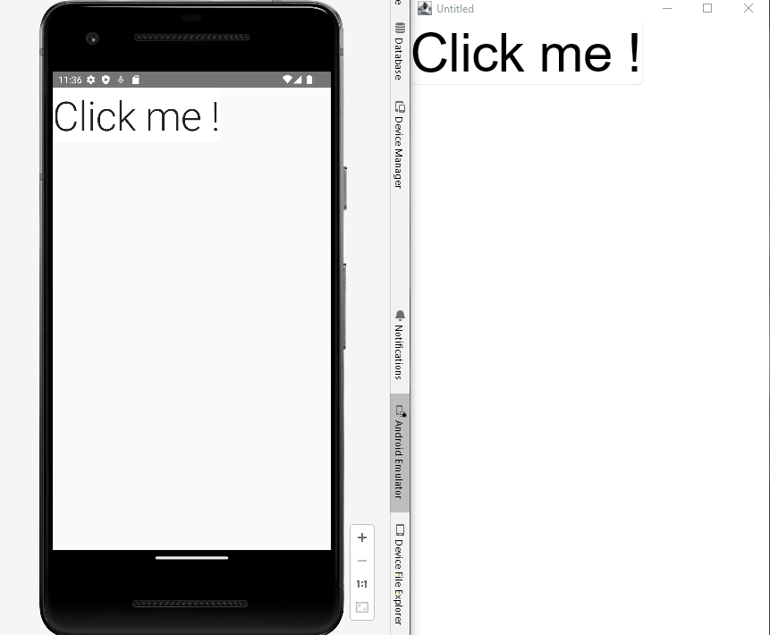
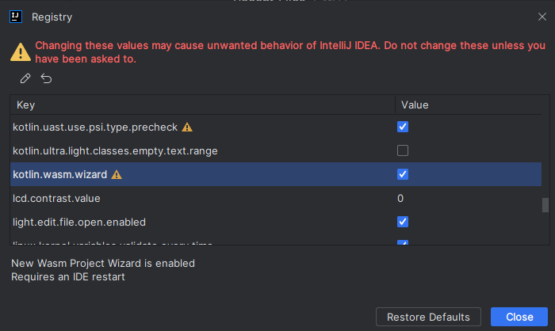
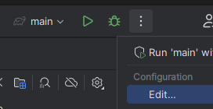
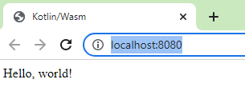

# Frontend development

Kotlin supports a wide selection of front frameworks from
It supports JVM to JS frameworks as well as exclusive ones. Please find below a glimpse of the possibilities:

- On the desktop side
  - Thanks to JVM support, Kotlin supports [JavaFX](https://openjfx.io/).
    - :bulb: There is even a Kotlin counterpart called [tornadofx](https://tornadofx.io/).
  - [Compose Multiplatform](https://www.jetbrains.com/lp/compose-mpp/) brings Jetpack Compose to the desktop and the web.
- On the web
  - [Ktor](https://ktor.io/docs/creating-interactive-website.html) can use templates engines [such as FreeMarker](https://freemarker.apache.org/) to create server pages.
  - With KotlinJS, developers can create React, nodsjs, or vanilla JS Apps using Kotlin.
  - Kotlin WASM compiles into Web Assembly. It can complement KotlinJS for computation intensive tasks.
- On mobiles
  - Android developers use the [Jetpack Compose](https://developer.android.com/jetpack/compose) UI Framework or the legacy **xml layouts**.

## Compose multiplatform

[Compose multiplatform](https://blog.jetbrains.com/kotlin/2021/08/compose-multiplatform-goes-alpha/) is a family of declarative UI frameworks for Android (Jetpack Compose), the desktop (Compose Desktop), and the web (Compose Web).

::: warning state of compose multiplatform as of August 2022

Currently, IntelliJ can create compose projects that include both Android and Desktops.
The web platform is not yet included, but it is still possible to create Compose projects only for web or only for desktop.

For Android only compose apps (Jetpack Compose), please use **Android Studio**.

:::

Google provides a [JetPack compose tutorial](https://developer.android.com/jetpack/compose/tutorial) for Android development.

## PW create a Compose desktop + Android app

- Create a new project on IntelliJ -> Compose Multiplatform.
- Choose "multiple platforms" and fill the other fields. Then choose **Finish**.
- IntelliJ starts preparing the project and may request to install plugins.
- Once ready, run the android app using the green run button.
- Run the Desktop app by running the main function on the desktop project (should be in `Main.kt`).
- Modify `App.kt` in the main project as follows and run the app.

```kotlin
@Composable
fun App() {
    val platformName = getPlatformName()
    Card {
        var expanded by remember { mutableStateOf(false) }
        Column(Modifier.clickable { expanded = !expanded }) {
            Text(
                text="Click me !",
                style = MaterialTheme.typography.h2
            )
            AnimatedVisibility(expanded){
                Text(
                    text = "Hello, ${platformName} 🎊",
                    style = MaterialTheme.typography.h1
                )
            }
        }
    }
}
```



## PW create a Compose web app

- Create a new IntelliJ project -> Compose Multiplaform.
- Choose "Single platform" -> "Web" and fill the other fields.
- Choose **Finish**
- IntelliJ may take some time to prepare the project and may request to install additional plugins.
- Launch the development server of the web app sing this command ` ./gradlew jsBrowserRun --continuous`.
- Modify `Main.kt` as follows and run the app.
- Open this address: `localhost:8080`.

```kotlin
fun main() {
    renderComposable(rootElementId = "root") {
        Div({ style { padding(25.px) } }) {
            var expanded by remember { mutableStateOf(false) }
            Button(
                attrs = {
                    onClick { expanded = !expanded }
                }
            ) { Text("Click me") }
            Div({ style { display(if (expanded) DisplayStyle.Block else DisplayStyle.None) } }) {
                Text("Click me !")
            }
        }
    }
}
```


## PW: KotlinJS web app

## PW: Kotlin WASM web app

- Enable the kotlin wasm wizard by enabling **kotlin.wasm.wizard** in IntelliJ's registry (open the registry by double tapping shift and typing "registry" in the search box) or clone [this project](https://github.com/worldline/learning-kotlin/tree/main/material/kotlin-wasm-starter).



- Check that kotlin is set to at least **1.8.20** in **build.gradle.kts** (the wizard may set it to a previous version).
- Open **src/wasmMain/kotlin/sample.kt** and click on the run button that appears next to the `main` function.
- If the build fails because the IDE used the wrong gradle task (the one that corresponds to a KotlinJS project), please change it to `wasmBrowserDevelopmentRun` and try to run again.




- The development server should start and you can open your wasm powered webapp on [http://localhost:8080/](http://localhost:8080/)



- Open ouiput/
- https://github.com/WebAssembly/wabt
