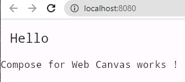

# Cross-plaform app Codelab

## PW : Cross-platform app + KMM + KMP for Android, iOS and Desktop

By combining KMP, KMM and Compose, it is possible to fully develop cross-platform mobile and desktop apps using only Kotlin.

This pw is so huge [that it has its own codelab](https://worldline.github.io/learning-kotlin-multiplatform/)

## PW : Add a Ktor server App

We'll extend the previous app with a Ktor server and a React web client.
The project will have the following architecture.

- Add a module into the project called **sharedFullStack** which will contain
  - Some shared code in commonMain that will by used by the **shared** project.
  - A Ktor server that provides a Rest API to get the questions and hosts some html files. One of the HTML files will load a react app that will be developed in Kotlin/JS.
  - A react web client in jsMain. This will only generate the JS code, the HTML page that loads the JS code will be provided by Ktor server as explained above.
- Update the build file of this new module
  - Add the `kotlin("multiplatform")` plugin and target all possible platforms (web, desktop, jvm ans mobile) for completeness.
  - ⚠️ Our clean task may conflict with Kotlin/JS's one, if that the case, we can fix this by renaming our clean task in the root **build.gradle.kts**
  - We need to add two tasks so that
  - The file should [look as follows]()
- Move the API model and client files from **shared** to **sharedFullStack** (`Anwser`, `Quiz`, `Question`)
- Add the relevant plugin and dependencies to **sharedFullStack** for the different source sets: `commonMain`, `jvmMain` and `jsMain`
- ⚠️ In the android build file, add **io.netty.versions.properties** and **INDEX.LIST** to packagingOptions excludes.
- Write the necessary code for both the server and the client

  - The server provides on "/" an html file that loads **sharedFullStack.js** because this is the name of the JS that is generated

- Change the QuizAPI class so that it calls our local server _http://localhost:8081/quiz_ and remove the arguments of the json method above since the server sets the correct headers for the JSON content type.

## PW: Add a Compose for Web Canvas target (experimental)

Compose for Web Canvas allows to use the same API surface as Compose Dekstop and Android.

- Add a module named **composeWebCanvasApp** and define it as a Kotlin/JS web app
  - Set the **js** target in the build file with Compose for Web Canvas dependencies
  - Create an index.html file that loads
    - JS that is generated by Kotlin/JS and
    - **skiko.js** which is dependency of Compose for Web Canvas
- ⚠️ The current `App()` imported from main crashes on this target because we are not using precompose for the web. In the current correction we just place a `Text` while we look for a fix.
  - Add this [Kotlin file]() which defines a `BrowserViewportWindow` that allows to render a composable into a Canvas.
  - Add this [Kotlin file]() which defines a default theme for the App
  - The main Kotlin file has [the following code]()
- Run the app by launching the `jsBrowserDevelopmentRun` gradle task of the **composeWebCanvasApp** module.

## Going futher

- Add a Compose Web target to the project

## Sources and references

- [Full Stack JVM & JS App Hands-On Lab](https://github.com/kotlin-hands-on/jvm-js-fullstack)
- [Build a full-stack web app with Kotlin Multiplatform](https://kotlinlang.org/docs/multiplatform-full-stack-app.html)
- [Build a web application with React and Kotlin/JS — tutorial](https://kotlinlang.org/docs/js-react.htm)
- [JetBrains/skiko](https://github.com/JetBrains/skiko)
- [burnoo/DemoListApp](https://github.com/burnoo/DemoListApp)
