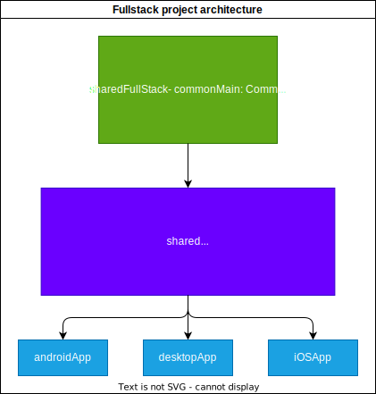
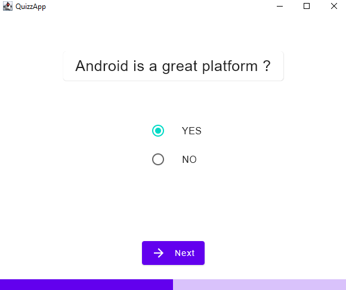

# Application multiplateforme et Fullstack Codelab (60min)

## TP : Application multiplateforme + KMM + KMP pour Android, iOS et ordinateur de bureau

En combinant KMP, KMM et Compose, il est possible de développer des applications mobiles et de bureau multiplateformes en utilisant uniquement Kotlin.

La première partie de ce labo [est accessible depuis ce lien](https://worldline.github.io/learning-kotlin-multiplatform/)

## PW : Ajouter une application serveur Ktor

Nous allons étendre l'application précédente avec un serveur Ktor et un client web React.
Le projet aura l'architecture suivante (❗ Ce choix d'architecture peut être sujet à discussion, mais nous nous en tiendrons à cela pour l'instant)

- Ajouter un module dans le projet appelé **sharedFullStack** qui contiendra :
  - Dans _commonMain_ : Du code partagé qui sera utilisé par le projet **shared**.
  - Dans _jvmMain_ : Un serveur Ktor qui sert une API Rest pour fournir les _questions_ et héberge quelques fichiers HTML. L'un des fichiers HTML chargera une application react qui sera développée en Kotlin/JS.
  - Dans _jsMain_ : Un client web react. Cette cible ne générera que le code JS, la page HTML qui le charge sera fournie par le serveur Ktor comme expliqué plus haut.
  - 💡 Avec IntelliJ vous pouvez faire un clic droit sur les dossiers **xxxMain/kotlin** et **xxxMain/resources** et utiliser **Mark Directory as** pour obtenir plus de support de la part de l'IDE.
- Mettez à jour le fichier de construction de ce nouveau module comme suit :
  - plugins : `multiplatform`, `serialilzation` et `application`. Ce dernier sera utilisé pour spécifier le fichier principal du serveur qui sera exécuté avec la tâche `run`.
  - Ajoutez le plugin `kotlin("multiplatform")` et ciblez toutes les plateformes possibles (web, desktop, jvm et mobile) pour être complet.
  - Les dépendances devraient être les suivantes :
    - _commonMain_ : client kotr (puisque nous voulons ajouter le client API dans le code partagé)
    - _jvmMain_ : serveur ktor + sérialisation json + cors (pour que le html puisse charger le JS)
    - _jsMain_ : Kotlin React
  - Nous devons ajouter deux tâches, la première produit l'application JS React et l'autre copie dans les ressources du serveur Ktor.
  - Définir la classe principale du plugin `application`.
  - Le fichier devrait [ressembler à ce qui suit] (https://github.com/worldline/learning-kotlin/blob/main/material/kmm-fullstack-demo/sharedFullStack/build.gradle.kts)
- Déplacer le modèle API et les fichiers clients de **shared** vers **sharedFullStack** (`Anwser`, `Quiz`, `Question`, `QuizAPI` et `QuizRepository`)
- ⚠️ Quelques points à noter :
  - Dans le fichier de construction d'android, ajoutez **io.netty.versions.properties** et **INDEX.LIST** au fichier de construction d'android.
  - Notre tâche globale de nettoyage peut entrer en conflit avec celle de Kotlin/JS, si c'est le cas, nous pouvons corriger cela en renommant notre tâche de nettoyage dans la racine **build.gradle.kts**
    packagingOptions exclues.
- Ecrivez le code nécessaire pour le serveur et le client. Le serveur doit fournir ces points de terminaison :
  - Un GET sur `/` fournit un fichier html qui charge **sharedFullStack.js** parce que c'est le nom du JS qui est généré.
  - Un GET sur `/quiz` fournit un JSON de `Quiz` généré par le serveur
  - Un GET sur `/quiz.html` sert une page HTML générée par le serveur en utilisant le HTML DSL.
- Changez la classe `QuizAPI` pour qu'elle appelle notre serveur local _http://localhost:8081/quiz_ et supprimez les arguments de la méthode json ci-dessus puisque le serveur met en place les bons headers.
- Lancer la tâche gradle "application -> run" du module **sharedFullStack**, qui copiera le JS généré dans le dossier ressources du serveur Ktor.
- Ouvrez _http://localhost:8081_ pour exécuter l'application react

- Exécutez l'application de bureau qui récupère le quiz sur le serveur local.

- Le test sur mobile est un peu plus complexe parce que localhost peut être mappé à une autre adresse et que le HTTP non sécurisé est bloqué par défaut.

Le projet final est [disponible ici] (https://github.com/worldline/learning-kotlin/tree/main/material/kmm-fullstack-demo) dans le module **sharedFullStack**.

## PW : Ajouter une cible Compose for Web Canvas (expérimental)

Compose for Web Canvas permet d'utiliser la même surface d'API que Compose Desktop et Android.
Ajoutons un autre module pour l'expérimenter.

- Dans la racine **settings.gradle.kts**, ajoutez ce dépôt maven `maven("https://maven.pkg.jetbrains.space/public/p/compose/dev")` qui a les dépendances de Compose for Web Canvas.
- Dans **gradle.properties**, ajoutez cette ligne `org.jetbrains.compose.experimental.jscanvas.enabled=true`.
- Dans le fichier de construction du module **shared**, ajoutez une cible `js(IR) { browser() }` et un sourceSet **jsMain** avec ces dépendances : `compose.web.core`, `compose.ui` et `compose.material3`.
  - Implémentez le fichier `Platform` et fournissez un composable pour l' `App`. Voici un [exemple d'implémentation] (https://github.com/worldline/learning-kotlin/tree/main/material/kmm-fullstack-demo/shared/src/jsMain/kotlin/com/devoxxfr2023/km)
- Ajoutez un module nommé **composeWebCanvasApp** et définissez
