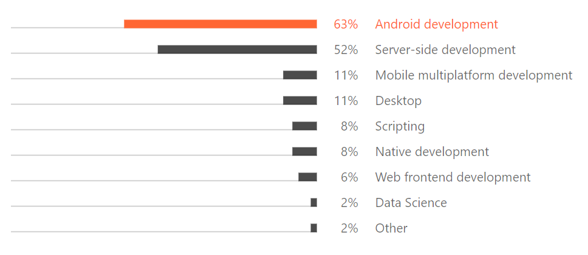

# Présentation de Kotlin

Kotlin est un langage de programmation moderne développé par JetBrains.

## Certaines fonctionnalités

- Kotlin est capable de compiler vers différentes cibles : la JVM, JS, Android, iOS, Les OS de bureau, etc.
  - Pris en charge officiellement par de grands frameworks back-end, tels que Spring et Quarkus,
  - Langage préféré pour le développement Android,
  - Kotlin Native compile en code natif,
  - Kotlin peut être considéré comme un langage _fullstack_
- Interopérable avec Java.
- Fournit des fonctionnalités modernes telles que la **null safety** à la compilation.
- Prend en charge la programmation orientée objet et la programmation fonctionnelle.
- Processus d'évolution open source: [Kotlin KEEP](https://github.com/Kotlin/KEEP).

## Histoire

- 15 février 2016 : sortie de Kotlin 1.0.
- 4 janvier 2017 : Spring a introduit le support de Kotlin dans Spring 5.
- Lors de Google I/O 2017, Google a annoncé une prise en charge officielle de Kotlin sur Android.
- Le 7 mai 2019, Google a annoncé que Kotlin était le langage préféré des développeurs d'applications Android.
- Juin 2022 : Kotlin 1.7 est sorti avec la version du nouveau compilateur K2.

## Quelques chiffres et faits

[Source : Amyra Sheldon](https://medium.com/predict/8-stats-and-fact-you-should-know-about-kotlin-in-2021-b41133a1834)

- En 2022, Kotlin est utilisé par 7,8 % des experts de l'industrie.
- Selon StackOverflow, Kotlin était le 4ème langage le plus apprécié en 2020 avec 62,9 % des votes.
- Kotlin est désormais répertorié parmi les 20 meilleurs langages de programmation par Redmonk.
- Kotlin fait partie des 3 principaux langages vers lesquels la plupart des entreprises prévoient de migrer leurs applications en 2022.
- Kotlin est utilisé par des entreprises mondiales telles que Google, Netflix, Amazon, Trello, etc.
- Plusieurs entreprises dont [Google](https://www.youtube.com/watch?v=o14wGByBRAQ), Pinterest et Uber ont migré leurs applications de Java vers Kotlin.

Veuillez trouver plus de statiques ici :

- [Recensement Kotlin 2020](https://www.jetbrains.com/lp/kotlin-census-2020/)
- [État Kotlin de JetBrains en 2021](https://www.jetbrains.com/lp/devecosystem-2021/kotlin/)

## Pourquoi passer de Java à Kotlin

Voici quelques arguments qui motivent le passage de Java (version 17 LTS au moment de la rédaction) à Kotlin.

- Kotlin prend en charge plus de cibles que Java.
- Kotlin protège des références null à la compilation (les `Optional` Java sont ne sont pas de protections à la compilation).
- Les chaînes de caractères Kotlin prennent en charge l'interpolation.
- Les fonctionnalités de programmation fonctionnelle de Kotlin sont meilleures. Il permet même de définir des constructeurs et des DSL (Domain Specific Language) dont le typage est sécurisé (type-safe).
- Kotlin peut être mélangé avec du code Java, facilitant ainsi le processus de migration.

Vous pouvez lire plus d'arguments dans ces articles :

- [Java Vs Kotlin : Lequel vaut-il mieux apprendre en 2022 ?](https://codersera.com/blog/java-vs-kotlin/)
- [8 raisons pour lesquelles vous devriez passer à Kotlin depuis Java] (https://www.geeksforgeeks.org/8-reasons-why-you-should-switch-to-kotlin-from-java)

## Sources et plus de lecture

- [Kotlin sur Wikipedia](<https://en.wikipedia.org/wiki/Kotlin_(programming_language)>)
- [Présentation de la prise en charge de Kotlin dans Spring Framework 5.0](https://spring.io/blog/2017/01/04/introducing-kotlin-support-in-spring-framework-5-0)
- [8 statistiques et faits à connaître sur Kotlin en 2022](https://medium.com/predict/8-stats-and-fact-you-should-know-about-kotlin-in-2021-b41133a1834)
- [Pourquoi devriez-vous apprendre Kotlin en 2022 ?](https://dev.to/aashiya123/why-should-you-learn-kotlin-in-2021-57e2)
